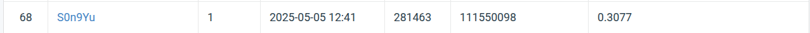

# DLCV 2025 HW3

name: 楊宗儒
id: 111550098

## Introduction

In this homework, we need to train a Mask-RCNN based model to segment the instance in images of cells from multiple organs

## How to install

### Dataset
```
gdown 1B0qWNzQZQmfQP7x7o4FDdgb9GvPDoFzI
mkdir data
mv hw3-data-release.tar.gz data
cd data
tar -xzf hw3-data-release.tar.gz
```

### Run Container

```
docker build -t dlcv-hw3 .
docker run --shm-size=8g --detach --rm -it --init --gpus=all -v $(pwd):/app --name dlcv-hw dlcv-hw3
docker attach dlcv-hw
```

### Train

After attach to the container: 
```
python3 src/train.py
```

the model would be at /app/checkpoint/

### Inference

```
python3 src/inference.py
```

The output is in test-results.json


## Performance Snapshot

